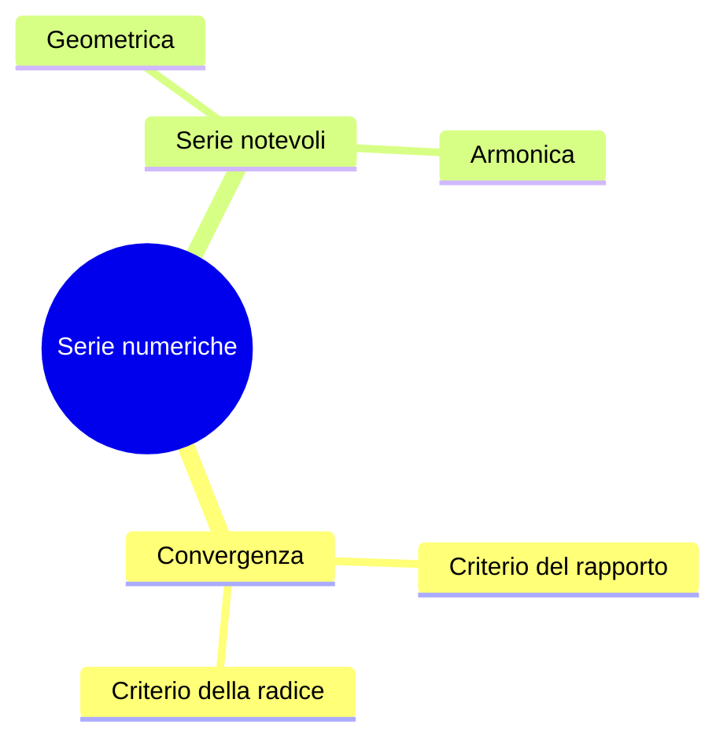

# Formati degli output di studio

Template esatti per lo stadio 3. Rispettare la struttura: serve a rendere confrontabili le lezioni
di uno stesso corso e a permettere il riassunto d'insieme a fine semestre.

---

## `riassunto.md`

Il file principale. Lunghezza indicativa: un decimo della trascrizione. Una lezione da due ore
sta in 1.500–2.000 parole.

```markdown
# <Corso> — <Titolo della lezione>
<data> · durata <hh:mm> · [trascrizione](trascrizione.md)

## In due righe
<Cosa si è fatto oggi e perché, in due frasi. Deve bastare a chi rilegge fra tre mesi.>

## Concetti

### <Primo concetto> [00:04:15]
<Spiegazione in prosa, come l'ha data il docente ma ripulita dal parlato.>

- **Definizione**: <se il docente l'ha enunciata, testuale>
- **Esempio del docente**: <l'esempio concreto che ha usato, vale più della definizione>

### <Secondo concetto> [00:22:40]
...

## Formule e risultati
| Formula | Significato | Dove serve |
|---|---|---|
| $\int_a^b f(x)\,dx$ | ... | ... |

⚠️ Le formule dettate a voce vanno verificate sulle slide o sul libro.

## Segnalato dal docente
- [01:12:05] "Questo all'esame lo chiedo sempre" → <argomento>
- [00:47:30] Capitolo 4 del libro, esercizi 12–18
- [01:30:10] Prossima lezione: <argomento>

## Domande degli studenti
- **D** [00:55:00]: <domanda>
  **R**: <risposta del docente>

## Da chiarire
- ⚠️ [00:38:20] Passaggio poco chiaro nell'audio: <cosa manca>
- Il docente ha citato "<termine>" senza definirlo.
```

Regole sul contenuto:

- L'**esempio concreto** del docente va sempre riportato. È la parte che fa capire la definizione ed
  è quella che sparisce per prima dagli appunti presi a mano.
- La sezione **Segnalato dal docente** è la più preziosa del file. Se durante la lezione non è stato
  detto niente del genere, lasciarla vuota, non riempirla con deduzioni.
- **Da chiarire** non è un difetto del riassunto: è la lista delle cose da chiedere a ricevimento.

---

## `mappa.md`

Elenco puntato annidato, compatibile con [markmap](https://markmap.js.org) (si incolla il testo e
si ottiene una mappa navigabile) e leggibile così com'è in Obsidian.

```markdown
# Mappa — <Titolo della lezione>

## <Macro-argomento>
### <Concetto>
- <proprietà o punto chiave>
- <proprietà o punto chiave>
#### <Sotto-concetto>
- ...
### <Concetto collegato>
- collegamento: dipende da <concetto> perché ...
```

Massimo quattro livelli di profondità: oltre, la mappa smette di essere leggibile e tanto valeva il
riassunto. Le **relazioni** tra concetti (dipende da, generalizza, è un caso particolare di, si
contrappone a) vanno scritte esplicitamente, altrimenti la mappa è solo un indice rientrato.

Quando servono relazioni non gerarchiche, usare Mermaid al posto dell'elenco:



---

## `flashcard.csv`

Per l'importazione in Anki. CSV con virgolette, tre colonne, senza riga di intestazione:
`fronte,retro,tag`.

```csv
"Cos'è una successione di Cauchy?","Una successione in cui le distanze fra i termini tendono a zero al crescere degli indici.","analisi2 lez03"
"Criterio del rapporto: enunciato","Se il limite del rapporto fra termini consecutivi è < 1 la serie converge, se > 1 diverge, se = 1 il criterio non decide.","analisi2 lez03"
```

Come importarle: in Anki, `File → Importa`, separatore virgola, mappare la terza colonna su Tag.

Regole per scrivere buone flashcard:

- **Una nozione per carta.** Se il retro ha due frasi con una "e" in mezzo, sono due carte.
- **Il fronte è una domanda**, non un titolo. "Criterio del rapporto" non è una carta, "quando il
  criterio del rapporto non decide?" sì.
- Niente carte su ciò che si ricorda comunque. Da una lezione ne escono 15–25 buone, non 60.
- Le formule si scrivono in LaTeX fra `\(` e `\)`: Anki le rende con MathJax.

---

## `quiz.md`

Autoverifica prima dell'esame. Domande e risposte separate, così si può rispondere davvero.

```markdown
# Quiz — <Titolo della lezione>

## Domande
1. <domanda aperta, del tipo che farebbe il docente all'orale>
2. ...

## Risposte
1. <risposta, con il timestamp del punto della lezione: [00:14:30]>
2. ...
```

Tarare le domande su come esamina il docente, se dalla trascrizione si capisce: chi in aula chiede
dimostrazioni va interrogato su dimostrazioni, chi chiede esempi su esempi.

---

## `riassunto-corso.md`

Si costruisce dai `riassunto.md`, mai dalle trascrizioni grezze.

```markdown
# <Corso> — quadro d'insieme
Aggiornato al <data> · <n> lezioni

## Filo del corso
<Come si sviluppano gli argomenti dalla prima lezione all'ultima, in un paragrafo.>

## Argomenti
| Argomento | Lezioni | Peso a esame |
|---|---|---|
| ... | lez 01, 03 | segnalato dal docente |

## Collegamenti fra lezioni
- <Argomento della lezione 5> riprende <argomento della lezione 2>: ...

## Tutto ciò che il docente ha segnalato per l'esame
<Unione delle sezioni "Segnalato dal docente" di tutte le lezioni, in ordine.>

## Buchi
- Lezione del <data> non registrata.
- ⚠️ <punti rimasti da chiarire, raccolti da tutte le lezioni>
```
